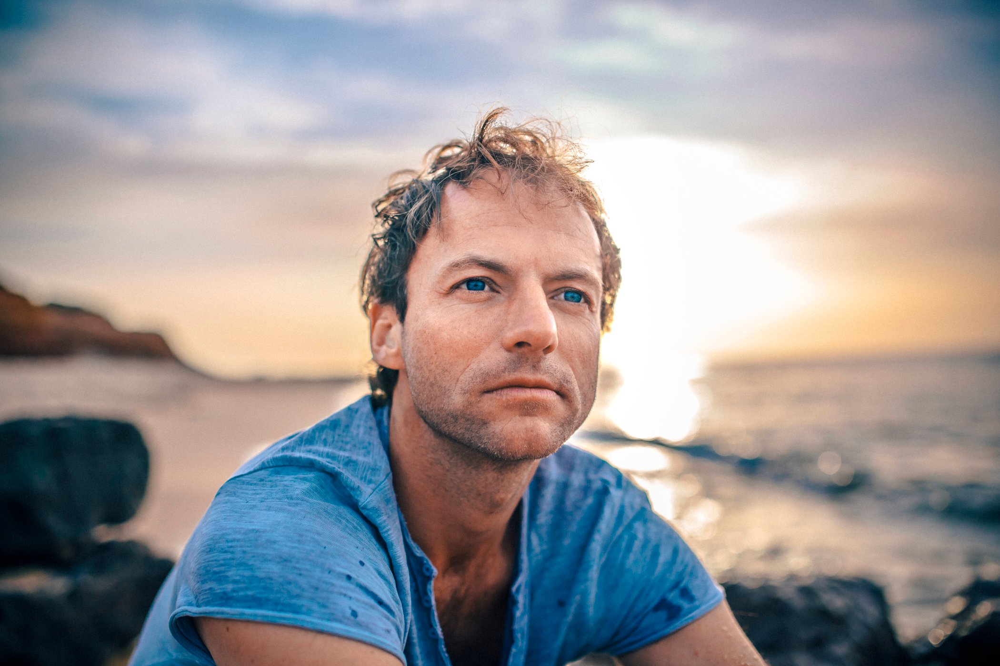

# How to Deploy constantincranz.com
## A simple guide for the implementer

This is **constantincranz.com** — Constantin's personal teacher site. A single-page landing site for The Sovereign Year, with a real intake form for applications.

The architecture is clean and intentional: Conscious Creation (the teaching) lives at consciouscreation.art. Constantin Cranz (the personal teacher) lives at constantincranz.com. They link to each other but stay distinct.

---

## File Structure

```
/personal-site
  ├── index.html           The single-page landing site
  ├── styles.css           Complete design system (matches Conscious Creation brand)
  ├── favicon.svg          Browser tab icon
  └── DEPLOYMENT_GUIDE.md  This file
```

That's it. Three files. One page.

---

## Quick Path — Live in 10 Minutes

### Step 1 — Deploy via Netlify (recommended)

1. Go to **netlify.com** → log in (use the same account as the other sites)
2. Click **"Add new site" → "Deploy manually"**
3. Drag the entire `personal-site` folder into the upload zone
4. Live at a random URL like `constantin-cranz-12345.netlify.app` within 30 seconds
5. Test it. Click around. Verify the form scrolls correctly when you click "Begin the Application."

### Step 2 — Connect the constantincranz.com Domain

1. In Netlify dashboard → **Domain management** → **Add custom domain**
2. Enter `constantincranz.com`
3. Netlify shows DNS records to add — typically:
   - An **A record** pointing to a Netlify IP
   - A **CNAME record** for `www` subdomain
4. Add those records in the registrar where Constantin bought constantincranz.com
5. Wait 1-24 hours for DNS to propagate
6. SSL is automatic (Let's Encrypt)
7. Site lives at `https://www.constantincranz.com`

---

## Step 3 — Wire Up the Application Form

**This is the most important step.** The form currently has a placeholder action URL. You need to connect it to a real form handler so applications actually reach Constantin.

### Recommended: Formspree

Formspree is the simplest form handler. Free for up to 50 submissions/month, which is plenty for a yearlong cohort with twelve practitioners.

1. Go to **formspree.io** → sign up (use Constantin's email: constantincranz@gmail.com)
2. Create a new form. Set the destination email to **constantincranz@gmail.com**
3. Formspree gives you a form endpoint URL like `https://formspree.io/f/abc12345`
4. Open `index.html` in a text editor
5. Find this line (around line 250):
   ```html
   <form ... action="https://formspree.io/f/YOUR_FORM_ID_HERE">
   ```
6. Replace `YOUR_FORM_ID_HERE` with your actual form ID (e.g., `abc12345`)
7. Re-deploy (drag the folder to Netlify again, or push if connected to Git)

### Alternative: Netlify Forms (also free)

If you'd rather use Netlify's built-in forms instead of Formspree:

1. Open `index.html`
2. Find the `<form>` tag and add the attribute `data-netlify="true"`:
   ```html
   <form ... data-netlify="true" name="sovereign-year-application" ...>
   ```
3. Add a hidden input right after the opening `<form>` tag:
   ```html
   <input type="hidden" name="form-name" value="sovereign-year-application">
   ```
4. Remove the `action="..."` and `method="POST"` attributes (Netlify handles them)
5. Update the JavaScript at the bottom of the file — change the success path to redirect to a thank-you (or just let the success message display, which the current code does)
6. Re-deploy
7. Submissions appear in your Netlify dashboard under "Forms"
8. Configure email notifications to forward to constantincranz@gmail.com

### Test the Form

Before announcing the site, **submit a test application yourself**. Verify:

- The form actually arrives in Constantin's inbox
- All fields come through with their content
- The success message displays after submission
- The form doesn't break on mobile

---

## Step 4 — Add the Real Portrait Photo

Currently, the "Portrait will live here" placeholder sits in the About section. When Constantin has a portrait photo:

1. Save the photo as `portrait.jpg` (or `.webp` for smaller file size) in the `personal-site` folder
2. Open `index.html`
3. Find the `.portrait-placeholder` div and replace its contents:
   ```html
   <div class="portrait-placeholder">
     
   </div>
   ```
   (Or remove the wrapper entirely and just use a clean `` with appropriate styling.)

The portrait should be **soft natural light, contemplative, no smiling-into-camera marketing pose**. Vertical format works best (4:5 aspect ratio matches the placeholder).

---

## Step 5 — Constantin's Video Introduction (Future)

The Sovereign Year page on consciouscreation.art has a video placeholder for a short personal introduction. When Constantin records that video:

1. Upload the video to **Vimeo** (recommended for quality and clean embed) or YouTube
2. Get the embed code
3. Open `consciouscreation.art/sovereign-year.html`
4. Find the `.video-placeholder` div
5. Replace it with the embed code

Keep the video short — 2 to 4 minutes. Just Constantin speaking quietly to camera, in good light, about what the Year is.

---

## Final Checks

Before announcing the site:

- [ ] All sections of the page display correctly
- [ ] The "Begin the Application" button scrolls smoothly to the form
- [ ] All form fields work — try filling them and submitting
- [ ] Form submission actually arrives in Constantin's inbox (test with a real submission)
- [ ] The success message displays after submission
- [ ] The link to consciouscreation.art at the bottom works
- [ ] The site is responsive on mobile (test on a real phone)
- [ ] SSL is active (URL starts with `https://`)
- [ ] Browser tab shows the gold ❖ favicon

---

## A Note on the Form Design

This form is intentionally substantial. It is not a contact form. It is an application — for a yearlong, high-investment, deeply personal container. The questions are designed to:

1. **Surface readiness.** Anyone who's not ready will not finish the application.
2. **Generate self-clarity for the applicant.** Even if not selected, the writing has value.
3. **Give Constantin enough to make a real decision** about whether the year is right for this person.

The form takes 20-30 minutes to complete properly. That's appropriate. If the form is "too long," the applicant probably isn't ready for a yearlong, high-investment commitment.

**Resist the urge to "simplify" or "shorten" the form.** The friction is the filter. The form is doing important work.

---

## A Note on Voice

This site is more personal than consciouscreation.art. It speaks in first person ("I work with..."). It's still elevated, dignified, principle-rooted — but it's *Constantin* speaking, not "the teaching." The voice difference is intentional.

When editing copy, maintain that distinction:
- **consciouscreation.art** = the teaching. Speaks in second/third person. Impersonal in the right sense.
- **constantincranz.com** = the man. Speaks in first person. Personal. Intimate.

---

## When Stuck

For implementation: **constantincranz@gmail.com**

For form-related issues:
- Formspree docs: docs.formspree.io
- Netlify Forms: docs.netlify.com/forms

---

❖

*The teacher does not call. Life calls. The site simply holds the door.*

— Implementation guide for constantincranz.com
